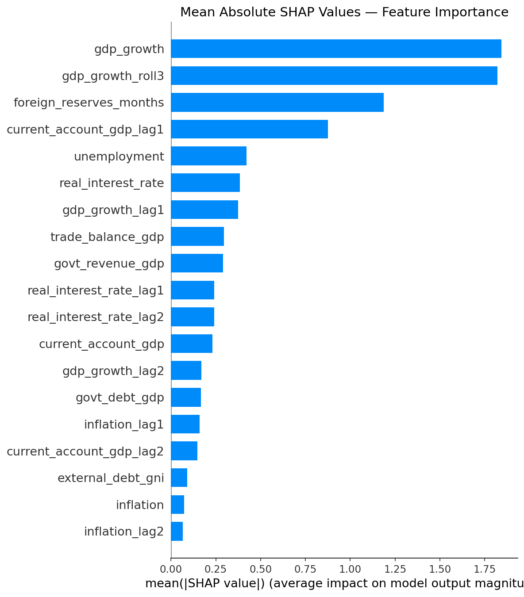
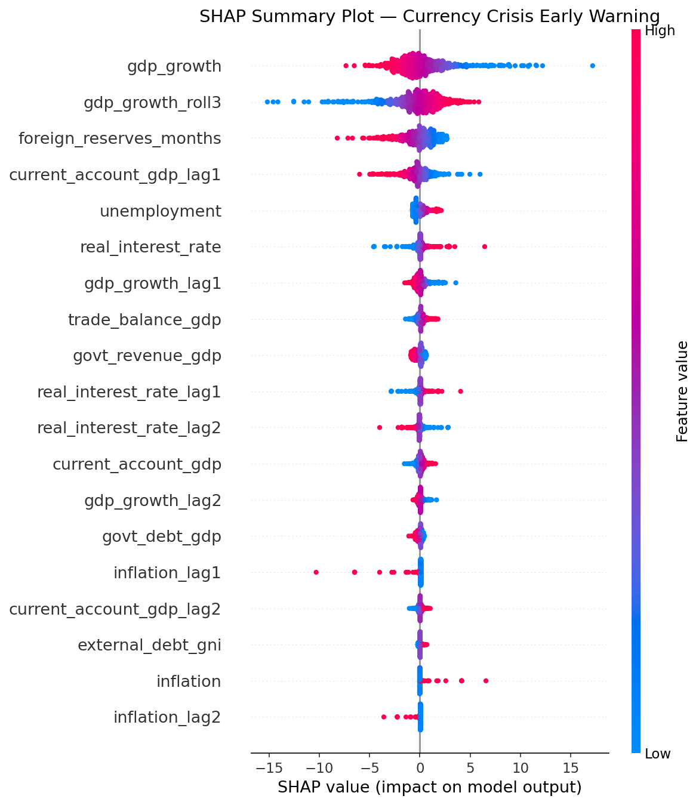
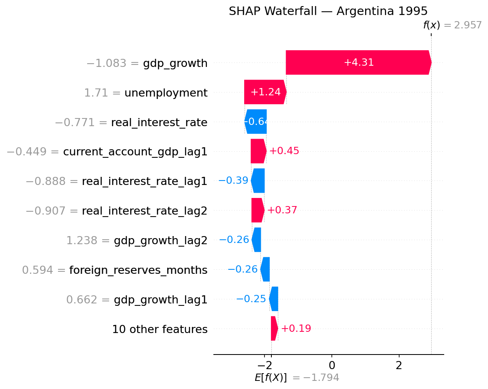

# Currency Crisis Early Warning System

An end-to-end machine learning pipeline that predicts currency crises in emerging market economies using macroeconomic indicators from the World Bank and IMF. Built with Python, scikit-learn, and AWS S3.

## Overview

Currency crises — sudden sharp depreciations of a country's exchange rate — can devastate economies, wipe out savings, and trigger recessions. This project builds an early warning system (EWS) that identifies at-risk countries 1-2 years before a crisis using publicly available macroeconomic data.

The system covers 30 emerging market economies across Latin America, Asia, Africa, and Eastern Europe from 1990 to 2017. Crisis labels are based on Laeven & Valencia (2020) and Frankel & Rose (1996).

## Key Results

| Model | AUC-ROC | Recall | Precision |
|---|---|---|---|
| **Logistic Regression** | **0.909** | **0.750** | 0.091 |
| LightGBM | 0.822 | 0.000 | 0.000 |
| XGBoost | 0.800 | 0.250 | 0.025 |
| Random Forest | 0.794 | 0.500 | 0.047 |

Logistic Regression outperformed all tree-based models — consistent with economics literature finding that simpler linear models generalize better for rare macroeconomic events on small panel datasets. The model caught 3 out of 4 crisis episodes in the test set (2008–2017) with an AUC of 0.909.

## SHAP Explainability

The top features driving crisis risk predictions:





The waterfall plot below explains a single prediction — Argentina 1995 (Tequila Effect contagion from Mexico's 1994 crisis):



**Key findings:**
- GDP growth slowdown is the strongest predictor — a contracting economy signals vulnerability
- Low foreign reserves leave the central bank unable to defend the currency under speculative attack
- Persistent current account deficits (1-year lag) indicate structural dependency on foreign capital
- High unemployment amplifies crisis risk by reducing fiscal flexibility

These findings are consistent with Kaminsky, Lizondo & Reinhart (1998), one of the most cited papers in the currency crisis literature.

## Project Structure
```
currency-crisis-early-warning/
│
├── src/
│   ├── ingestion/
│   │   ├── world_bank.py           # pulls macroeconomic indicators via World Bank API
│   │   ├── imf_weo.py              # pulls fiscal indicators from IMF WEO dataset
│   │   └── build_labels.py         # builds crisis labels from historical episodes
│   ├── features/
│   │   ├── engineer.py             # merges datasets, creates lag and rolling features
│   │   └── correlation_analysis.py # removes redundant features (r > 0.85)
│   ├── models/
│   │   ├── train.py                # trains and compares 4 models
│   │   ├── tune.py                 # hyperparameter tuning (GridSearch + RandomizedSearch)
│   │   └── explain.py              # SHAP explainability plots
│   └── api/
│       └── lambda_handler.py       # AWS Lambda handler for crisis risk API
│
├── outputs/
│   └── shap/                       # SHAP explainability plots
│
├── requirements.txt
├── .gitignore
└── README.md
```
## Data Pipeline

Data is pulled from two public sources and stored in AWS S3:

**World Bank API** — 9 macroeconomic indicators per country per year:
- GDP growth, inflation, current account balance, external debt, foreign reserves, trade balance, unemployment, real interest rate, broad money growth

**IMF World Economic Outlook** — 7 fiscal indicators:
- Government revenue, expenditure, debt, GDP growth, inflation, unemployment

**Crisis Labels** — binary target variable (1 = crisis, 0 = no crisis) built from documented currency crisis episodes based on Laeven & Valencia (2020) and Frankel & Rose (1996).

## Feature Engineering

- Lag features (t-1, t-2) for key indicators to capture early warning signals up to 2 years before a crisis
- 3-year rolling averages to smooth short-term noise and capture medium-term trends
- Correlation analysis to remove redundant features (threshold r > 0.85) — reduced from 39 to 19 features

## Modeling

- Time-based train/test split (train: 1990–2007, test: 2008–2017) to simulate real-world forecasting
- SMOTE applied to training data to handle class imbalance (42 crisis years vs 602 non-crisis years)
- 4 models trained and compared: Logistic Regression, Random Forest, LightGBM, XGBoost
- Hyperparameter tuning with GridSearchCV (Logistic Regression) and RandomizedSearchCV (XGBoost)
- Best model saved to AWS S3

## AWS Architecture

- **S3** — stores raw data, processed features, trained models, and SHAP plots
- **Lambda** — serves crisis risk predictions via REST API (see `src/api/lambda_handler.py`)

## API

The Lambda handler accepts a POST request and returns a risk score with top contributing features:

**Request:**
```json
{
  "country": "Argentina",
  "year": 2015
}
```

**Response:**
```json
{
  "country": "Argentina",
  "year": 2015,
  "risk_score": 0.73,
  "risk_level": "High",
  "top_features": [
    {"feature": "gdp_growth", "value": -2.3, "impact": "increases risk"},
    {"feature": "foreign_reserves_months", "value": 4.1, "impact": "increases risk"}
  ]
}
```

## Limitations

- Test set contains only 4 crisis years (2008–2017) which limits evaluation robustness
- Crisis labels end at 2017 due to data availability
- Tree-based models underperformed due to small dataset size — a known limitation for rare event prediction on panel data

## References

- Laeven, L. & Valencia, F. (2020). Systemic Banking Crises Database II. IMF Economic Review.
- Frankel, J. & Rose, A. (1996). Currency Crashes in Emerging Markets. Journal of International Economics.
- Kaminsky, G., Lizondo, S. & Reinhart, C. (1998). Leading Indicators of Currency Crises. IMF Staff Papers.

## Author

**[Elif-Selma Yilmaz](https://github.com/selmayilmaz13)**